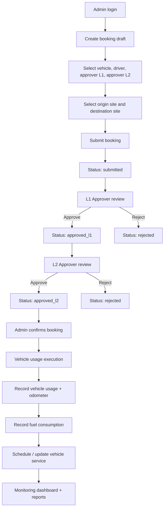

# Booking Activity Diagram

```mermaid
flowchart TD
    A[Admin login] --> B[Create booking draft]
    B --> C[Select vehicle, driver, approver L1, approver L2]
    C --> C1[Select origin site and destination site]
    C1 --> D[Submit booking]
    D --> E[Status: submitted]

    E --> F[L1 Approver review]
    F -->|Approve| G[Status: approved_l1]
    F -->|Reject| R1[Status: rejected]

    G --> H[L2 Approver review]
    H -->|Approve| I[Status: approved_l2]
    H -->|Reject| R2[Status: rejected]

    I --> I1[Admin confirms booking]
    I1 --> J[Vehicle usage execution]
    J --> J1[Record vehicle usage + odometer]
    J1 --> K[Record fuel consumption]
    K --> L[Schedule / update vehicle service]
    L --> M[Monitoring dashboard + reports]
```
