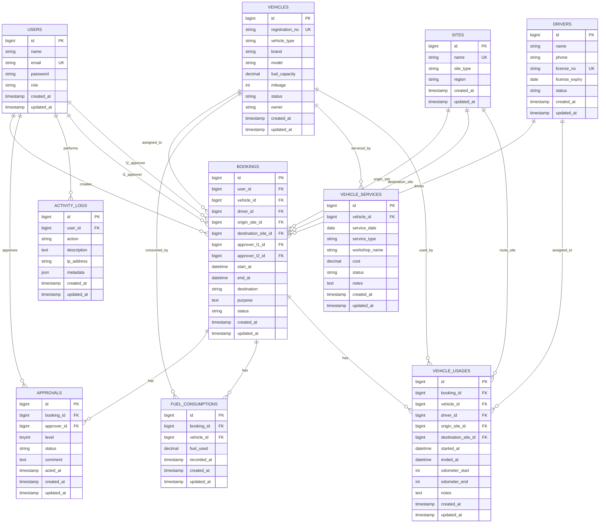

# Physical Data Model (ERD)

```mermaid
erDiagram
    USERS ||--o{ BOOKINGS : creates
    USERS ||--o{ APPROVALS : approves
    USERS ||--o{ ACTIVITY_LOGS : performs
    USERS ||--o{ BOOKINGS : l1_approver
    USERS ||--o{ BOOKINGS : l2_approver
    SITES ||--o{ BOOKINGS : origin_site
    SITES ||--o{ BOOKINGS : destination_site

    VEHICLES ||--o{ BOOKINGS : assigned_to
    VEHICLES ||--o{ FUEL_CONSUMPTIONS : consumed_by
    VEHICLES ||--o{ VEHICLE_SERVICES : serviced_by
    VEHICLES ||--o{ VEHICLE_USAGES : used_by

    DRIVERS ||--o{ BOOKINGS : drives
    DRIVERS ||--o{ VEHICLE_USAGES : assigned_to

    BOOKINGS ||--o{ APPROVALS : has
    BOOKINGS ||--o{ FUEL_CONSUMPTIONS : has
    BOOKINGS ||--o{ VEHICLE_USAGES : has
    SITES ||--o{ VEHICLE_USAGES : route_site

    USERS {
      bigint id PK
      string name
      string email UK
      string password
      string role
      timestamp created_at
      timestamp updated_at
    }

    SITES {
      bigint id PK
      string name UK
      string site_type
      string region
      timestamp created_at
      timestamp updated_at
    }

    VEHICLES {
      bigint id PK
      string registration_no UK
      string vehicle_type
      string brand
      string model
      decimal fuel_capacity
      int mileage
      string status
      string owner
      timestamp created_at
      timestamp updated_at
    }

    DRIVERS {
      bigint id PK
      string name
      string phone
      string license_no UK
      date license_expiry
      string status
      timestamp created_at
      timestamp updated_at
    }

    BOOKINGS {
      bigint id PK
      bigint user_id FK
      bigint vehicle_id FK
      bigint driver_id FK
      bigint origin_site_id FK
      bigint destination_site_id FK
      bigint approver_l1_id FK
      bigint approver_l2_id FK
      datetime start_at
      datetime end_at
      string destination
      text purpose
      string status
      timestamp created_at
      timestamp updated_at
    }

    APPROVALS {
      bigint id PK
      bigint booking_id FK
      bigint approver_id FK
      tinyint level
      string status
      text comment
      timestamp acted_at
      timestamp created_at
      timestamp updated_at
    }

    FUEL_CONSUMPTIONS {
      bigint id PK
      bigint booking_id FK
      bigint vehicle_id FK
      decimal fuel_used
      timestamp recorded_at
      timestamp created_at
      timestamp updated_at
    }

    VEHICLE_SERVICES {
      bigint id PK
      bigint vehicle_id FK
      date service_date
      string service_type
      string workshop_name
      decimal cost
      string status
      text notes
      timestamp created_at
      timestamp updated_at
    }

    VEHICLE_USAGES {
      bigint id PK
      bigint booking_id FK
      bigint vehicle_id FK
      bigint driver_id FK
      bigint origin_site_id FK
      bigint destination_site_id FK
      datetime started_at
      datetime ended_at
      int odometer_start
      int odometer_end
      text notes
      timestamp created_at
      timestamp updated_at
    }

    ACTIVITY_LOGS {
      bigint id PK
      bigint user_id FK
      string action
      text description
      string ip_address
      json metadata
      timestamp created_at
      timestamp updated_at
    }
```
